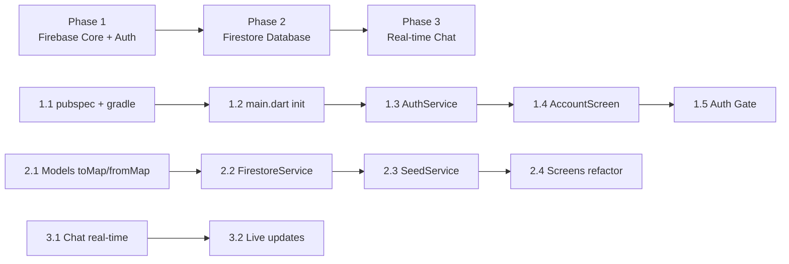

# Tích hợp Firebase — Database & Real-time cho TeamTask

## Bối cảnh

App TeamTask hiện tại sử dụng **mock data cứng** (`mockGroups`, `mockTasks`, …) trong `models.dart`. Tất cả dữ liệu chỉ tồn tại trong bộ nhớ RAM — mất khi restart. Bước tiếp theo là chuyển toàn bộ sang **Firebase** để có:
- Database thực (Cloud Firestore)
- Xác thực người dùng (Firebase Authentication) 
- Chat real-time (Firestore Realtime listeners)

Hiện tại project dùng Gradle Kotlin DSL (`build.gradle.kts`), SDK `^3.10.7`, Android `com.example.do_an`.

---

## User Review Required

> [!IMPORTANT]
> **Bạn cần tạo Firebase Project trước khi bắt đầu code:**
> 1. Truy cập [Firebase Console](https://console.firebase.google.com)
> 2. Tạo project mới (ví dụ: `teamtask-app`)
> 3. Bật **Authentication** → Email/Password provider
> 4. Tạo **Cloud Firestore** database (chế độ Test mode hoặc Production)
> 5. Cài **FlutterFire CLI**: `dart pub global activate flutterfire_cli`
> 6. Chạy `flutterfire configure` trong thư mục project → chọn platforms (Android, Web, …)
>    - Lệnh này sẽ tự động tạo file `firebase_options.dart` và cấu hình `google-services.json`
>
> **Tôi sẽ KHÔNG thể tự tạo Firebase project cho bạn** — bạn cần làm bước này thủ công.

> [!WARNING]
> **minSdk cần nâng lên 23+**: Firebase Auth yêu cầu `minSdk >= 23`. Hiện tại project dùng `flutter.minSdkVersion` (mặc định 21). Tôi sẽ override thành 23 trong `build.gradle.kts`.

---

## Open Questions

> [!IMPORTANT]
> **Platform mục tiêu**: Bạn chạy app chủ yếu trên nền tảng nào? Android, Web, hay cả hai? Điều này ảnh hưởng cách cấu hình Firebase.

> [!NOTE]
> **Phạm vi tích hợp**: Plan này bao gồm **3 phase** — bạn có muốn triển khai cả 3 phase cùng lúc hay làm từng phase để test?
> - Phase 1: Firebase Core + Auth (đăng nhập/đăng ký thực)
> - Phase 2: Firestore Database (groups, tasks, members — thay thế mock data)
> - Phase 3: Real-time listeners (chat real-time, task updates tức thì)

---

## Proposed Changes

### Phase 1: Firebase Core + Authentication

Mục tiêu: Cài Firebase vào project, chuyển màn hình Tài khoản từ giả lập sang xác thực thực sự.

---

#### [MODIFY] [pubspec.yaml](file:///e:/DAIHOC/New%20folder/pubspec.yaml)

Thêm các dependencies Firebase:
```yaml
dependencies:
  firebase_core: ^3.13.0
  firebase_auth: ^5.6.0
  cloud_firestore: ^5.6.6
```

---

#### [MODIFY] [build.gradle.kts (app)](file:///e:/DAIHOC/New%20folder/android/app/build.gradle.kts)

- Override `minSdk = 23` (yêu cầu bởi Firebase Auth)

---

#### [MODIFY] [main.dart](file:///e:/DAIHOC/New%20folder/lib/main.dart)

- Import `firebase_core` và `firebase_options.dart`
- Gọi `Firebase.initializeApp()` trước `runApp()`
- Chuyển `main()` sang `async`

```dart
import 'package:firebase_core/firebase_core.dart';
import 'firebase_options.dart';

void main() async {
  WidgetsFlutterBinding.ensureInitialized();
  await Firebase.initializeApp(options: DefaultFirebaseOptions.currentPlatform);
  runApp(const TeamTaskApp());
}
```

---

#### [NEW] [lib/services/auth_service.dart](file:///e:/DAIHOC/New%20folder/lib/services/auth_service.dart)

Service wrapper cho Firebase Auth:
```dart
class AuthService {
  final FirebaseAuth _auth = FirebaseAuth.instance;
  
  User? get currentUser => _auth.currentUser;
  Stream<User?> get authStateChanges => _auth.authStateChanges();
  
  Future<UserCredential> signIn(String email, String password);
  Future<UserCredential> register(String email, String password, String name);
  Future<void> signOut();
  Future<void> resetPassword(String email);
}
```

---

#### [MODIFY] [account_screen.dart](file:///e:/DAIHOC/New%20folder/lib/screens/account_screen.dart)

- Thay `Future.delayed()` giả lập bằng gọi `AuthService.signIn()` thực
- Đăng ký gọi `AuthService.register()` thực → tạo user trên Firebase
- Quên mật khẩu gọi `AuthService.resetPassword()` → gửi email thật
- Thêm trạng thái đã đăng nhập: hiển thị thông tin user + nút Đăng xuất
- Xử lý các Firebase Exception (`invalid-email`, `user-not-found`, `wrong-password`, …)

---

#### [MODIFY] [home_screen.dart](file:///e:/DAIHOC/New%20folder/lib/screens/home_screen.dart)

- Lắng nghe `AuthService.authStateChanges` 
- Nếu chưa login → hiển thị `AccountScreen` (login page)
- Nếu đã login → hiển thị app chính với Sidebar

---

### Phase 2: Firestore Database — Thay thế Mock Data

Mục tiêu: Toàn bộ Groups, Tasks, Members, Activities lưu trên Firestore. Khi tạo/xóa/sửa → ghi lên Firestore thay vì chỉ sửa list trong RAM.

---

#### Firestore Schema (thiết kế database)

```
Firestore Database
│
├── users/{userId}
│   ├── email: string
│   ├── name: string
│   ├── initials: string
│   ├── avatarColorIndex: number
│   └── groupIds: [string]  // danh sách ID nhóm tham gia
│
├── groups/{groupId}
│   ├── name: string
│   ├── description: string
│   ├── isActive: boolean
│   ├── createdBy: string (userId)
│   ├── createdAt: timestamp
│   ├── memberIds: [string]  // danh sách userId
│   ├── channels: [string]   // tên các kênh chat
│   │
│   ├── members/{memberId}   ← subcollection
│   │   ├── name: string
│   │   ├── initials: string
│   │   ├── role: string
│   │   ├── taskCount: number
│   │   └── avatarColorIndex: number
│   │
│   ├── tasks/{taskId}       ← subcollection
│   │   ├── title: string
│   │   ├── status: string (todo|doing|done)
│   │   ├── assignee: string
│   │   ├── deadline: string
│   │   ├── type: string (task|kanban) // phân biệt task vs kanban task
│   │   └── createdAt: timestamp
│   │
│   ├── messages/{messageId} ← subcollection
│   │   ├── sender: string
│   │   ├── text: string
│   │   ├── channel: string
│   │   ├── userId: string
│   │   └── createdAt: timestamp
│   │
│   └── activities/{activityId} ← subcollection
│       ├── actor: string
│       ├── action: string
│       ├── detail: string
│       ├── time: timestamp
│       └── colorIndex: number
```

---

#### [NEW] [lib/services/firestore_service.dart](file:///e:/DAIHOC/New%20folder/lib/services/firestore_service.dart)

Service chính cho tất cả CRUD operations:

```dart
class FirestoreService {
  final FirebaseFirestore _db = FirebaseFirestore.instance;

  // ── Groups ──
  Stream<List<Group>> watchGroups(String userId);
  Future<void> createGroup(Group group, String userId);
  Future<void> updateGroup(String groupId, Map<String, dynamic> data);
  Future<void> deleteGroup(String groupId);

  // ── Tasks ──
  Stream<List<Task>> watchTasks(String groupId, {String? type});
  Future<void> createTask(String groupId, Task task);
  Future<void> updateTaskStatus(String groupId, String taskId, String status);
  Future<void> deleteTask(String groupId, String taskId);

  // ── Messages (real-time) ──
  Stream<List<Message>> watchMessages(String groupId, String channel);
  Future<void> sendMessage(String groupId, Message msg, String channel);

  // ── Members ──
  Stream<List<TeamMember>> watchMembers(String groupId);
  Future<void> addMember(String groupId, TeamMember member);
  Future<void> removeMember(String groupId, String memberId);

  // ── Activities ──
  Stream<List<GroupActivity>> watchActivities(String groupId);
  Future<void> addActivity(String groupId, GroupActivity activity);
}
```

---

#### [MODIFY] [models.dart](file:///e:/DAIHOC/New%20folder/lib/models.dart)

- Thêm `toMap()` và `fromMap()` (factory constructor) cho tất cả models: `Task`, `Message`, `TeamMember`, `GroupActivity`, `Group`
- Thêm `userId` vào `Message` model
- Thêm `channel` vào `Message` model
- Thêm `type` field vào `Task` (phân biệt `task` vs `kanban`)
- Thêm `createdAt` vào `Task`, `GroupActivity`, `Message`
- Giữ lại mock data (dùng cho fallback/seed data khi chưa có Firestore)

Ví dụ:
```dart
class Task {
  final String id;
  String title;
  String status;
  String assignee;
  String deadline;
  String type; // 'task' | 'kanban'
  DateTime? createdAt;

  Task({...});

  Map<String, dynamic> toMap() => {
    'title': title,
    'status': status,
    'assignee': assignee,
    'deadline': deadline,
    'type': type,
    'createdAt': createdAt ?? FieldValue.serverTimestamp(),
  };

  factory Task.fromMap(String id, Map<String, dynamic> map) => Task(
    id: id,
    title: map['title'] ?? '',
    status: map['status'] ?? 'todo',
    assignee: map['assignee'] ?? '',
    deadline: map['deadline'] ?? '',
    type: map['type'] ?? 'task',
    createdAt: (map['createdAt'] as Timestamp?)?.toDate(),
  );
}
```

---

#### [MODIFY] Tất cả screens — Chuyển từ mock data sang Firestore streams

Các screen cần refactor:

##### [MODIFY] [dashboard_screen.dart](file:///e:/DAIHOC/New%20folder/lib/screens/dashboard_screen.dart)
- Dùng `StreamBuilder` với `FirestoreService.watchGroups()` thay vì `mockGroups`
- Stat cards tính từ Firestore data

##### [MODIFY] [groups_screen.dart](file:///e:/DAIHOC/New%20folder/lib/screens/groups_screen.dart)
- `_createGroup()` → gọi `FirestoreService.createGroup()` 
- `_inviteMember()` → gọi `FirestoreService.addMember()`
- Danh sách members dùng `StreamBuilder` + `watchMembers()`

##### [MODIFY] [tasks_screen.dart](file:///e:/DAIHOC/New%20folder/lib/screens/tasks_screen.dart)
- Dùng `StreamBuilder` + `watchTasks(groupId, type: 'task')`
- `_addTask()` → `FirestoreService.createTask()`
- Toggle status → `FirestoreService.updateTaskStatus()`

##### [MODIFY] [kanban_screen.dart](file:///e:/DAIHOC/New%20folder/lib/screens/kanban_screen.dart)
- Dùng `StreamBuilder` + `watchTasks(groupId, type: 'kanban')`
- Drag & drop move → `FirestoreService.updateTaskStatus()`

##### [MODIFY] [timeline_screen.dart](file:///e:/DAIHOC/New%20folder/lib/screens/timeline_screen.dart)
- Timeline milestones lưu trên Firestore (subcollection riêng hoặc dùng chung tasks)

---

### Phase 3: Real-time Chat & Live Updates

Mục tiêu: Chat hoạt động real-time giữa nhiều users. Task/Kanban tự cập nhật khi có thay đổi.

---

#### [MODIFY] [chat_screen.dart](file:///e:/DAIHOC/New%20folder/lib/screens/chat_screen.dart)

- Messages lấy từ `StreamBuilder` + `watchMessages(groupId, channel)`
- Messages real-time: Firestore snapshot listener → UI cập nhật tức thì
- `_send()` → `FirestoreService.sendMessage()`
- Hiển thị sender name từ Firebase Auth `displayName`
- `isMine` check bằng `msg.userId == currentUser.uid`
- Messages sắp xếp theo `createdAt` ascending
- Auto-scroll khi có tin nhắn mới

---

#### [NEW] [lib/services/seed_service.dart](file:///e:/DAIHOC/New%20folder/lib/services/seed_service.dart)

Utility để import mock data vào Firestore lần đầu tiên:
```dart
class SeedService {
  /// Kiểm tra Firestore có dữ liệu chưa, nếu rỗng thì import mock data
  static Future<void> seedIfEmpty(String userId) async { ... }
}
```

---

#### [MODIFY] [home_screen.dart](file:///e:/DAIHOC/New%20folder/lib/screens/home_screen.dart)

- `_selectedGroup` lấy từ Firestore stream thay vì `mockGroups[index]`
- Quản lý state phức tạp hơn → có thể cần refactor sang pattern tốt hơn (Provider hoặc giữ StreamBuilder)

---

## Tóm tắt files thay đổi

| File | Thay đổi | Phase |
|------|----------|-------|
| `pubspec.yaml` | Thêm firebase deps | 1 |
| `android/app/build.gradle.kts` | minSdk = 23 | 1 |
| `lib/main.dart` | Firebase.initializeApp | 1 |
| `lib/services/auth_service.dart` | **[NEW]** Auth wrapper | 1 |
| `lib/screens/account_screen.dart` | Auth thực | 1 |
| `lib/screens/home_screen.dart` | Auth gate + Firestore streams | 1 + 2 |
| `lib/models.dart` | toMap/fromMap, thêm fields | 2 |
| `lib/services/firestore_service.dart` | **[NEW]** CRUD Firestore | 2 |
| `lib/services/seed_service.dart` | **[NEW]** Import mock data | 2 |
| `lib/screens/dashboard_screen.dart` | StreamBuilder | 2 |
| `lib/screens/groups_screen.dart` | CRUD qua Firestore | 2 |
| `lib/screens/tasks_screen.dart` | StreamBuilder + CRUD | 2 |
| `lib/screens/kanban_screen.dart` | StreamBuilder + CRUD | 2 |
| `lib/screens/timeline_screen.dart` | StreamBuilder | 2 |
| `lib/screens/chat_screen.dart` | Real-time messages | 3 |

---

## Verification Plan

### Automated Tests
- `flutter analyze` — không lỗi compile
- `flutter build apk --debug` — build thành công

### Manual Verification

**Phase 1:**
- Đăng ký tài khoản mới → user xuất hiện trên Firebase Console
- Đăng nhập → vào app chính
- Đăng xuất → quay lại màn hình login
- Nhập sai mật khẩu → hiển thị lỗi cụ thể

**Phase 2:**
- Tạo nhóm mới → document xuất hiện trên Firestore
- Thêm task → task xuất hiện trong subcollection
- Toggle task status → Firestore document cập nhật
- Xóa thành viên → document bị xóa

**Phase 3:**
- Gửi tin nhắn → tin nhắn xuất hiện real-time trên thiết bị khác
- Chuyển task trên Kanban → thiết bị khác thấy ngay

---

## Thứ tự triển khai đề xuất



> [!TIP]
> Nên làm **Phase 1 trước** để kiểm tra Firebase đã cấu hình đúng, rồi mới tiến sang Phase 2 và 3. Nếu Phase 1 chạy ok thì Phase 2, 3 sẽ suôn sẻ.
